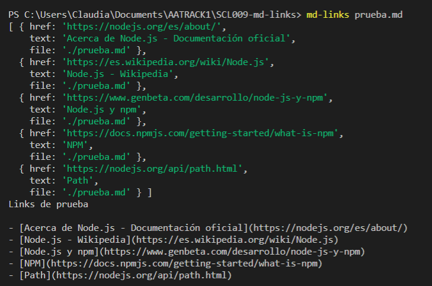
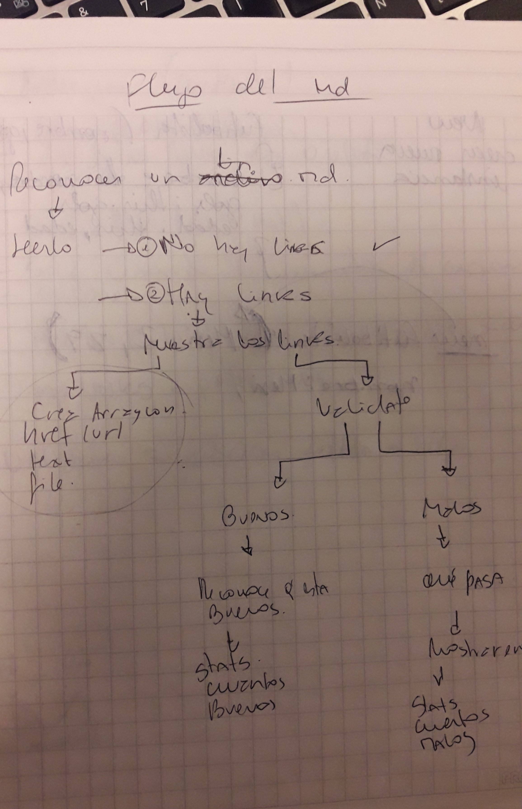

# Markdown Links

El programa es capaz de revisar archivos md y extraer los links que se encuentren en el, luego identifica y cuantifica los enlaces rotos y únicos.

## Instrucciones

Lo primero es instalar la librería con el siguiente comando:

npm i clau-md-links

El usuario solo debe escribir en la terminal "md-links" junto con el nombre del archivo, para que se ejecute el programa y pueda ver los links que se encuentren en el archivo md seleccionado.

Luego se podrá ver en la terminal como se muestra en el siguiente ejemplo:

## Flujo del proyecto

## Archivos del proyecto
index.js: Desde este archivo se exportó (mdLinks).

md-links.js: Este archivo contiene la función a exportar mdlinks que recibe como parámetro el arreglo de links. Esta función ejecuta acciones en base a los parámetros recibidos por la línea de comandos y retorna una promesa con los resultados de la ejecución.

## Planificación

El proyecto se llevó a cabo según la planificación [Trello](https://trello.com/b/7I62c7uY/md-links)

